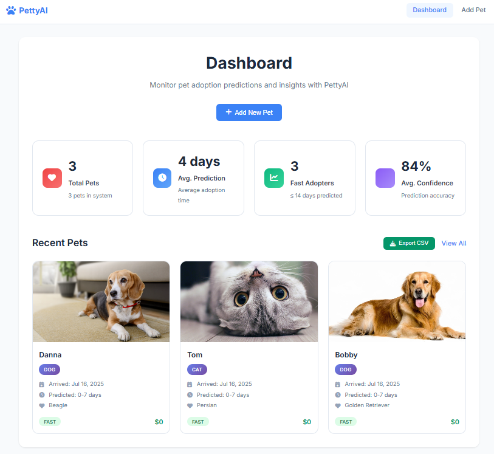

# PettyAI - Pet Adoption Prediction Application

PettyAI is a web application designed for animal shelters. It predicts how quickly a pet will be adopted based on its features like age, health, and personality. It can help shelters make faster, better decisions for their animals.

Finding forever homes for pets is not always easy. PettyAI simplifies this process using technology to help rescuers understand which pets are more likely to get adopted quickly, and which ones might need extra support or promotion.

<div align="center">* * * * *</div>

## Table of Contents

- [Features](#features)
- [Prediction Categories](#prediction-categories)
- [Take a Look](#take-a-look)
- [Project Structure](#project-structure)
- [Setup Instructions](#setup-instructions)
- [Using the Application](#using-the-application)
- [Data Management](#data-management)
- [Customization](#customization)
- [Data Privacy](#data-privacy)
- [Road Map](#road-map)
- [Contributing](#contributing)
- [License](#license)

## Features

- **Easy 6-Step Form**  
  Quickly add pet details using a simple form with 6 steps.

- **AI Predictions**  
  The app uses artificial intelligence to guess how long it will take for a pet to be adopted based on its info.

- **Smart Dashboard**  
  See live stats, helpful insights, and a full overview of all the pets in the system.

- **Clickable Pet Cards**  
  Click on any pet's photo to view more details or edit their profile.

- **Photo Upload**  
  Easily upload multiple pet pictures using drag-and-drop.

## Prediction Categories

The system predicts adoption time in 4 categories:
- **0-7 days**: Same day to first week (Fast adoption)
- **8-30 days**: First month (Fast adoption)
- **31-90 days**: 1-3 months (Moderate adoption)
- **100+ days**: Long-term care needed (Slow adoption)

## Take a Look

Explore how PettyAI makes pet management simple:

### Clean Start
<div align="center">
  
  <p><em>Starting fresh? The clean dashboard is ready for you to add your first pet</em></p>
</div>

### Add a Pet
<div align="center">
  
  <p><em>Use the easy 6-step form to create detailed and complete pet profiles in minutes</em></p>
</div>

### Smart Dashboard
<div align="center">
  
  <p><em>Get a full overview with live stats, recent pet profiles, and smart adoption predictions - all in one place</em></p>
</div>

### Interactive Pet Cards
<div align="center">
  
  <p><em>Click on any pet to view details, edit info, or manage their profile - it's all just one click away</em></p>
</div>

## Project Structure

```
PettyAI/
├── requirements.txt             # Python dependencies
├── backend.py                   # Main Flask server and ML backend│
├── frontend/                    # Frontend files
│   ├── local_app.html           # Main HTML application
│   └── assets/                  # Frontend assets
│       ├── styles.css           # Application styles
│       ├── script.js            # Main JavaScript logic
│       └── data.js              # Data constants and mappings
│
└── data/                        # Data and model files
    ├── clip_mlp_model.pt        # Trained PyTorch model
    └── pet_adoption_data.csv    # Pet data storage
├── requirements.txt             # Python dependencies
└── README.md                    # This file
```

## Setup Instructions

Choose one of the following options to get started:

### A) Frontend Only (Quick Start)

  **Open the App**
   - Just open the file called `local_app.html` in your web browser
   - You’ll see the dashboard with any pets you already saved
   - No need to set up a server
   - The app saves data in your browser and uses fake predictions for testing

### B) Full Setup with Python Backend

1. **Install Python Packages**
   ```bash
   pip install -r requirements.txt
   ```

2. **Run the Backend Server**
   ```bash
   python backend.py
   ```

3. **Open the App**
   - Open `local_app.html` in a web browser
   - The frontend will connect to the backend automatically

## Using the Application

### Adding a New Pet Profile

**Step 1: Basic Information**  
- Choose the pet type (Dog or Cat)  
- Enter the pet's name (optional)  
- Enter the pet's age in months  
- Enter the number of pets if it’s a litter  
- Set the adoption fee  

**Step 2: Physical Characteristics**  
- Pick the breed from a dropdown list (the list appears after choosing the pet type in Step 1)  
- Choose the pet’s gender  
- Select the main color  
- Set the expected full-grown size  
- Choose the fur length  

**Step 3: Health Information**  
- Mark vaccination status  
- Mark deworming status  
- Mark sterilization status  
- Describe the overall health condition  

**Step 4: Location**  
- Choose the state where the pet is located  

**Step 5: Description**  
- Write a detailed description of the pet’s personality, habits, or special needs  

**Step 6: Photos**  
- Upload multiple photos of the pet  
- You can drag and drop photos or click to select them  

> [!NOTE]
> Adding photos is recommended because it helps improve the system’s prediction accuracy.

### Viewing Predictions

After you finish the form:  
- Click the button "Ready to generate prediction!"  
- See how long the system thinks it will take to adopt the pet  
- Check how confident the system is in its prediction  
- Save the pet profile to add it to your database  

### Dashboard

See important information at a glance:  
- Total number of pets in the system  
- Average predicted adoption time  
- Number of pets expected to be adopted quickly  
- Average confidence level of all predictions  
- Recent pet profiles along with their predictions 

## Data Management

### Data Fields
The system saves:
- Basic info like type, breed, age, gender, color, size, fur length, health, location, and fees
- Text info like pet name and description
- Photos uploaded
- Predictions: adoption time and confidence
- Extra info: pet ID, rescuer info, and dates

### Prediction System
- Uses pet info like age, breed, health, and photos to make predictions
- Gives higher confidence when info is complete
- Groups pets by adoption speed: Fast (0-30 days), Medium (31-90 days), Slow (100+ days)

### CSV Export
- Press "Export CSV" on the dashboard to download all pet data
- The file includes all info and predictions

## Customization

### Adding New Breeds
Edit the `BREED_DATA` object in `data.js`:
```javascript
const BREED_DATA = {
    // Dogs
    1: { 
        999: "New Dog Breed"
    },
    // Cats
    2: {   
        999: "New Cat Breed"
    }
};
```

### Adding New Colors
Edit the `COLOR_DATA` object in `data.js`:
```javascript
const COLOR_DATA = {
    99: "New Color Name"
};
```

## Data Privacy

- All data is saved only in your browser by default  
- No data is sent outside unless you use the backend  
- Photo uploads stay on your device and are not sent anywhere  
- CSV exports include only the data you entered  

## Road Map

- [x] Multi-step form with 6 steps  
- [x] Dashboard with live stats and pet cards  
- [x] Photo uploads with drag-and-drop  
- [x] Save data locally  
- [x] Export CSV  
- [x] Create, edit, delete pet profiles  
- [x] Prediction confidence scores  
- [ ] Real-time model updates  
- [ ] Advanced search and filters  
- [ ] Support for multiple languages and currencies  
- [ ] Analytics with charts  
- [ ] Better model that supports for other pets and regions 

## Contributing

To help improve the app:
1. Add new features to the right files  
2. Update the README with your changes  
3. Test the app on different browsers and devices  
4. Make sure the design works well on all screens  

## License

>[!IMPORTANT]
>This project is for learning only.
>Please follow your local data privacy rules when using pet and adopter information.
>See `MIT LICENSE`.
